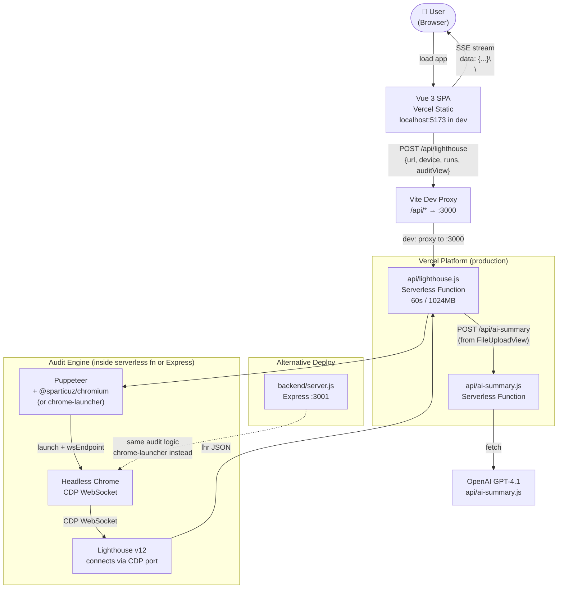
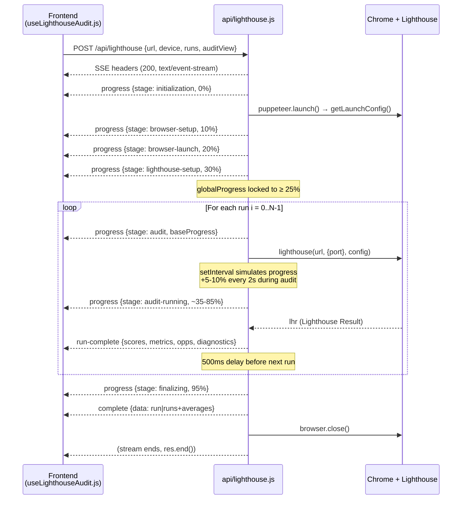

# Architecture

> **Dual-audience doc.** Written for future Claude Code sessions that need to understand the system, and for interview prep — the kind of doc you read for 5 minutes before a system design round and come out ready to talk for 30.

---

## 1. System overview

Lighthouse Performance Tests is a web application that measures how fast and accessible a website is. A user enters a URL, chooses a device type (desktop or mobile) and how many times to run the test, and clicks run. Within seconds, a real-time progress bar advances while a headless Chrome browser loads the target site, runs Google's open-source Lighthouse auditing engine against it, and streams results back. The user sees four category scores (Performance, Accessibility, Best Practices, SEO), Core Web Vitals, per-audit breakdowns, and — optionally — an AI-generated plain-language summary of what to fix and why.

The system runs across two tiers. The frontend is a Vue 3 single-page application deployed as a Vercel static build. The backend is a Vercel serverless function (the production path) that spins up a stripped Chromium binary on demand, runs Lighthouse against the target URL, and streams progress back to the browser over a long-lived HTTP response. There is also a standalone Express server in `/backend/` that does the same job using local system Chrome — it exists as an alternative deployment target for non-Vercel infrastructure and as a development convenience when `vercel dev` is unavailable.

The non-obvious architectural constraint is that Lighthouse is a CPU-heavy, multi-second process. It cannot be a fast JSON endpoint — it takes 5–30 seconds per run, longer on slow target sites. The entire streaming architecture exists to make that wait feel like progress rather than a frozen spinner.

---

## 2. Architecture diagram

### System topology



### Audit pipeline: SSE event sequence



---

## 3. Request lifecycle: a single audit

When a user enters a URL and clicks Run Audit:

**1. User submits the form**
`src/views/HomeView.vue` → `handleUrlSubmit()` → calls `useLighthouseAudit.runAudit(auditConfig)` with `{url, device, throttle, runs, auditView}`.

**2. State machine resets**
`src/composables/useLighthouseAudit.js` → `runAudit()` sets `isRunning = true`, zeros all refs (`scores`, `detailedMetrics`, `allRunsData`, etc.), dispatches `window.CustomEvent('audit-start')` so `AppSidebar` closes on mobile.

**3. Frontend opens the stream**
`src/utils/lighthouseApi.js` → `streamLighthouseAudit()` issues:
```
POST /api/lighthouse
Content-Type: application/json
Body: {"url":"...","device":"desktop","throttle":"none","runs":1,"auditView":"standard"}
```
Uses `fetch()` + `response.body.getReader()` — not `EventSource`, because `EventSource` only supports GET.

**4. Vite proxy forwards to Vercel**
`vite.config.js` proxies `/api/*` → `http://localhost:3000` (running `vercel dev`).

**5. SSE headers go out immediately**
`api/lighthouse.js` → `handler()` writes `200 text/event-stream` headers before touching Chrome. The connection is now open. The frontend's `fetch` resolves here — the `getReader()` loop starts consuming.

**6. Browser launch (progress: 0% → 30%)**
`api/lighthouse.js` → `prepareBrowser(isProduction, onProgress)` calls `getLaunchConfig.js`. In production (`process.env.VERCEL` truthy): `@sparticuz/chromium` provides a pre-built Chromium binary path and launch args. In development: `findLocalChrome.js` locates the local Chrome install. `puppeteer.launch(launchConfig)` starts the browser and returns a `wsEndpoint` (a `ws://localhost:{port}/...` URL).

**7. Lighthouse connects to Chrome via CDP**
`api/lighthouse.js` → `runLighthouseAudit()` extracts the port from `wsEndpoint`:
```js
port: new URL(wsEndpoint).port
```
Lighthouse does **not** launch its own browser — it connects via Chrome DevTools Protocol (CDP) WebSocket to the Puppeteer-managed Chrome instance. This is why the two are decoupled.

**8. Lighthouse runs (progress: 25% → 95%)**
`lighthouse(url, {port, output: 'json', logLevel: 'error'}, lighthouseConfig)` runs the full audit. Lighthouse exposes no granular progress events during execution. A `setInterval` running every 2 seconds simulates progress by adding 5–10% increments, capped at 90% of each run's allocated slice. All `onProgress()` calls enforce monotonic increase before writing `data: {...}\n\n` to the response.

**9. lhr extraction**
On `lighthouse()` resolving, `api/lighthouse.js` extracts from the raw `lhr` (Lighthouse Result) object:
- **scores**: `lhr.categories.*.score × 100` → integers 0–100
- **metrics**: 18 specific `lhr.audits[key].numericValue` fields (FCP, LCP, CLS, TBT, SI, TTI, etc.)
- **opportunities**: any audit with `details.overallSavingsMs > 0`
- **diagnostics**: any audit with `scoreDisplayMode === 'informative'` or `'notApplicable'`
- **fullReport** (only if `auditView === 'full'`): `{categories, audits, configSettings}` — the complete raw lhr structure

**10. `run-complete` event streams to frontend**
Each completed run emits `{type: 'run-complete', currentRun, totalRuns, runResult: {scores, metrics, opportunities, diagnostics}}`. The frontend appends one row to `allRunsData` and updates live score displays. Note: `fullReport` is **not** in `run-complete` — it only arrives in `complete`.

**11. Averaging (multi-run only)**
After all runs complete, `calculateAverages(runResults)` computes arithmetic means for scores and metrics across all runs. **Opportunities and diagnostics are not averaged** — they are taken from run 1 only.

**12. `complete` event closes the stream**
Single run: `{type: 'complete', data: {run, summary}}`. Multi-run: `{type: 'complete', data: {runs[], averages, summary}}`. `res.end()` is called. `browser.close()` runs in the `finally` block regardless of success or failure.

**13. Frontend finalizes state**
`useLighthouseAudit.js` → `handleProgressUpdate()` handles `type: 'complete'`: sets `auditResults`, finalizes `scores`/`detailedMetrics`/`opportunities`/`diagnostics`/`fullReport`.

**14. UI updates**
Vue reactivity propagates to `PerformanceMetrics.vue` (score cards), `AuditResults.vue` (table or full report). `AuditResults.vue` watches `hasAuditData` and triggers `animateSlideDownEntry()` + `animateCascade()` via GSAP. `HomeView.vue` watches `progress` hitting 100 and calls `playOn()` (pop sound via `useSound.js`).

---

## 4. Why two backends?

The short answer: Vercel serverless is the right default for a portfolio project; Express is the escape hatch when Vercel's constraints bite.

**`/api/` — Vercel serverless**

Vercel deploys each file in `api/` as an isolated serverless function. Zero infrastructure to manage: no EC2, no process manager, no uptime monitoring. The tradeoff is hard constraints: 60-second max execution time, 1024MB RAM, no persistent process, no filesystem writes outside `/tmp`. Each invocation is stateless and ephemeral.

The Chrome binary problem is the interesting part. A real Chrome install is ~300MB. Serverless functions have tight bundle size limits. `@sparticuz/chromium` is a community-maintained stripped Chromium build (~80MB compressed) that runs in Lambda-style environments. `vercel.json` explicitly includes it in the function bundle alongside Lighthouse and its peer dependencies. Without this `includeFiles` config, the function would deploy without Chrome and fail on every invocation.

**`/backend/` — standalone Express**

The Express server uses `chrome-launcher` to find whatever Chrome is already installed on the host. It runs as a persistent process on port 3001, has no timeout, and can (in principle) run BullMQ workers in the same process. It's the right choice for Railway, Render, or a VPS deploy.

The parity contract: both backends must emit the same SSE event types with identical field names and shapes. The frontend doesn't know which backend it's talking to — it just reads `data: {type, progress, ...}` off the stream. If they diverge, the frontend breaks silently with missing or misnamed fields. Today this is enforced by convention (the rule in `backend/CLAUDE.md`), not by a shared schema or type system.

**The upcoming inflection point**

BullMQ scheduled jobs (planned — see `FUTURE.md`) require a persistent Redis-connected worker process. Vercel serverless functions cannot run persistent workers — they terminate after `res.end()`. When that feature lands, the architecture needs to split: Vercel handles on-demand audits; a separate persistent service (likely the Express backend) handles scheduled job workers. This is the clearest reason the Express backend is not throwaway code.

---

## 5. Streaming: why SSE not WebSockets?

A Lighthouse audit is a one-way broadcast: the server has information (progress, results) that it pushes to the client. The client never sends anything mid-audit. WebSockets are a bidirectional full-duplex channel — that's the wrong tool for a unidirectional stream.

SSE is HTTP. The server sends a `200` response with `Content-Type: text/event-stream` and writes `data: {...}\n\n` lines. No protocol upgrade, no handshake, no special server support. It works through HTTP proxies (including Vite's dev proxy). It works inside Vercel serverless functions — the response body is just a long-lived write stream. WebSocket upgrades inside serverless functions are not reliably supported across platforms.

The implementation detail worth knowing: the frontend does **not** use the browser's `EventSource` API, even though this is technically an SSE stream. `EventSource` only works with GET requests. The audit requires a POST body (`{url, device, runs, auditView}`). Instead, `src/utils/lighthouseApi.js` uses `fetch()` and manually reads `response.body.getReader()`, parsing `data: ` lines out of the raw byte stream. The result is identical to `EventSource` from the consumer's perspective.

The one real tradeoff: SSE is unidirectional. If you wanted to cancel an in-progress audit from the browser, you'd need a separate `POST /api/cancel` endpoint — there's no in-stream message channel back to the server. That cancellation endpoint doesn't exist yet.

---

## 6. Where the bottlenecks are

**Vercel 60-second timeout.** Lighthouse itself sets `maxWaitForLoad: 45000ms` (45 seconds per run). Multi-run audits on slow target sites hit 60 seconds quickly. 3 runs × 20s each = 60s exactly. Any retries, network hiccups, or slow page loads push this over. There's no graceful degradation — the function terminates and the SSE connection drops.

**Cold starts.** The first request after a period of inactivity triggers a cold start: Vercel provisions a new container, loads the function bundle (~150MB+ including Chromium), and only then starts the handler. This adds 3–5 seconds before the first SSE event reaches the frontend. Subsequent requests within the same container reuse the warm instance. The frontend has no awareness of cold starts — the progress bar just sits at 0% for a few extra seconds.

**Lighthouse is single-threaded and CPU-bound.** One audit run occupies the function's CPU fully for its entire duration. The serverless function handles one audit at a time. There is no queue, no concurrency management, no rate limiting. If 10 users submit audits simultaneously, Vercel spins up 10 separate function instances (10× the cold start cost, 10× the Chromium memory). This works fine for a portfolio project; it would be expensive at scale.

**Progress simulation is fake.** During each Lighthouse execution, the server has no real progress signal from Lighthouse. It runs a `setInterval` every 2 seconds adding 5–10% randomly, capped at 90% of each run's progress budget. The bar is an approximation of real progress. A 5-second audit and a 30-second audit both animate the same way until `run-complete` arrives.

**OpenAI latency.** The AI summary (`api/ai-summary.js`) makes a synchronous `fetch` call to the OpenAI Chat Completions API. Response time varies 1–10 seconds. This is a separate request triggered by the user, not part of the audit stream, so it doesn't block audit results — but it makes the AI summary panel feel slow on poor network days.

**If traffic 10×'d:** The serverless model scales automatically (Vercel spins up new instances), but cost and cold-start frequency would spike. More critically, there's no auth and no rate limiting — anyone can trigger a 60-second Chrome instance. The realistic failure mode is Vercel usage bill, not downtime.

---

## 7. What's NOT here yet

- **No persistence.** Audit results are held in browser memory (`useLighthouseAudit.js` refs). Closing the tab loses everything. There's no database, no history, no saved results.
- **No authentication.** Any visitor can run an audit. There are no user accounts, no sessions, no JWT. The API is open.
- **No rate limiting.** Nothing prevents a single user from hammering the audit endpoint continuously.
- **No background jobs.** Audits only run on-demand when a user clicks run. There's no scheduling, no cron, no BullMQ worker.
- **No cancellation.** Once an audit starts, there's no way to stop it from the frontend. The SSE connection closes if the user navigates away, but the serverless function continues running until it finishes or times out.
- **No multi-tenancy.** There's no concept of "your audits" vs. "someone else's audits."

All of these are intentional deferments for v1. See `FUTURE.md` for the roadmap and `docs/decisions/` for the ADRs that explain the trade-offs.

---

## 8. Glossary

**SSE (Server-Sent Events)**: A standard HTTP mechanism for one-way server-to-client streaming. The server holds a `200` response open and writes `data: ...\n\n` lines. The browser reads them incrementally. Simpler than WebSockets; works over standard HTTP proxies.

**CDP (Chrome DevTools Protocol)**: The WebSocket protocol Chrome exposes for programmatic control — navigating pages, reading console output, running audits. Both Puppeteer and Lighthouse communicate with Chrome over CDP.

**BFF (Backend for Frontend)**: An API layer purpose-built for a specific frontend client, containing only the data-shaping and aggregation logic that frontend needs. `api/lighthouse.js` functions as a BFF: it calls Lighthouse, extracts and reshapes only the fields the Vue SPA needs, and discards the rest of the raw `lhr` object.

**MFE (Micro-Frontend)**: An architecture pattern where a frontend application is split into independently deployable UI modules, often owned by separate teams. Common in large enterprise apps (e.g., Williams-Sonoma's storefront architecture). This project is a single monolithic SPA — not an MFE — but the component layer boundaries (`layout/` / `sections/` / `common/` / `forms/`) mirror the separation-of-concerns thinking that MFE architectures enforce at the deployment level.

**Core Web Vitals**: Google's set of user-experience metrics that Lighthouse measures: **FCP** (First Contentful Paint — time until first text/image renders), **LCP** (Largest Contentful Paint — time until the largest above-the-fold element renders), **CLS** (Cumulative Layout Shift — visual stability; how much content jumps around during load), **TBT** (Total Blocking Time — how long the main thread was blocked by JavaScript), **TTI** (Time to Interactive — when the page becomes reliably interactive), **SI** (Speed Index — how quickly content is visually populated).

**Puppeteer**: A Node.js library that controls a Chrome or Chromium browser via CDP. In this project it's used only to launch Chrome and get a `wsEndpoint`. Lighthouse then takes over the browser via that endpoint.

**Lighthouse engine**: Google's open-source website auditing tool. Given a URL and a Chrome connection, it loads the page, runs ~150 individual audits across Performance, Accessibility, Best Practices, and SEO categories, and returns a raw `lhr` (Lighthouse Result) JSON object. In this project it runs inside the serverless function, not in the user's browser.

**`@sparticuz/chromium`**: A community-maintained stripped Chromium build (~80MB compressed) designed to run in AWS Lambda-style serverless environments where a full Chrome install is impractical. It provides the `executablePath` and recommended launch `args` for headless serverless operation.

---

## Appendix: known inconsistencies

These were found during the architecture audit and do not yet match the code:

1. **`vercel.json` sets `LC_ALL=C`** in its `env` block, but `api/lighthouse.js` lines 8–11 immediately overwrite it with `en_US.UTF-8` at module load time. The code wins. The `vercel.json` `env` value is misleading but harmless.

2. **`/api/lighthouse/audit/stream` route in `vercel.json`** is never called by the current frontend. The frontend calls `POST /api/lighthouse`, which is handled by the catch-all route `"/api/(.*)" → "/api/$1.js"`. The explicit `audit/stream` route is a legacy alias — safe to remove.

3. **`import fs from 'fs'` in `api/lighthouse.js:3`** is unused. Safe to remove.

4. **Multi-run opportunities and diagnostics are not averaged.** `calculateAverages()` in `api/lighthouse.js:414–415` takes both fields from `results[0]` only. Only `scores` and `metrics` are arithmetically averaged. This is an undocumented accuracy limitation: if run 1 happens to audit a slow cache response and run 2 is faster, the displayed opportunities reflect run 1's reality only.
